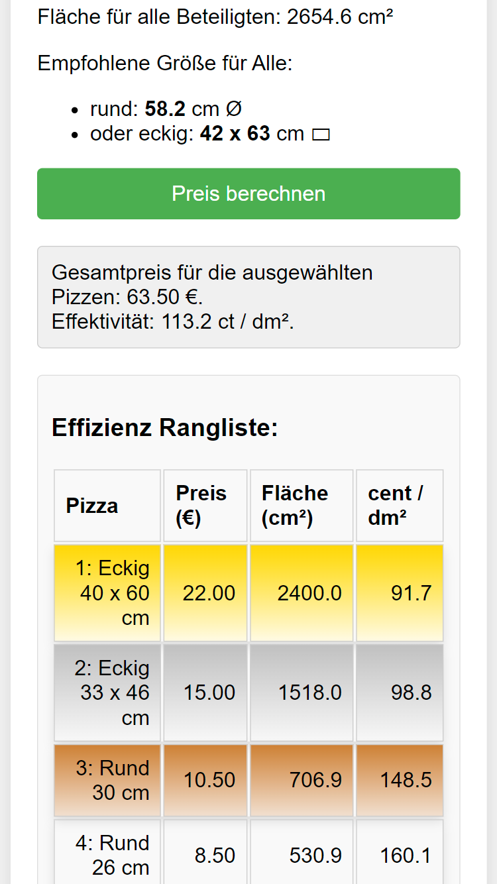

# Pizza Calculator

Willkommen zu meinem Pizza Calculator! Diese Seite hilft dir, die effizienteste Pizza basierend auf Preis und Fläche zu finden.
Ideal für alle Pizza-Fans, die das beste Preis-Leistungs-Verhältnis suchen.

## Funktionen

- **Pizzagrößen und -preise eingeben**: Gib verschiedene Größen und Preise für runde und rechteckige Pizzen ein.
- **Effizienz berechnen**: Berechnet den Preis pro Fläche für jede Pizza und zeigt eine Rangliste der effizientesten Pizzen an.
- **Visualisierung**: Zeigt die Pizzen visuell an, einschließlich der Möglichkeit, spezifische Stücke zu markieren.
- **Anteile berechnen**: Teile Pizzen in gleiche Stücke auf und markiere zusätzliche Stücke.

## Installation

1. **Clone das Repository**:
    ```bash
    git clone https://github.com/Dave2048IT/Pizza-Berechner.git
    ```

2. **Wechsle in das Verzeichnis**:
    ```bash
    cd pizza-berechner
    ```

3. **Öffne `index.html` in deinem Browser**.

## Nutzung

1. **Pizzagrößen und -preise anpassen**:
    - Du kannst die vorgegebenen Größen und Preise in den entsprechenden Feldern ändern.

2. **Effizienz berechnen**:
    - Klicke auf den `Berechnen`-Button, um die Preis-pro-Fläche-Rangliste zu sehen.

3. **Visualisierung und Anteile**:
    - Die Pizzen werden visuell dargestellt. Gib die Anzahl der Stücke ein, um die Aufteilung zu sehen. Zusätzliche Stücke werden blau markiert.

## Beispiel

Hier ein Beispiel, wie die Seite aussieht:



## Mitmachen

1. **Fork das Repository**.
2. **Erstelle einen neuen Branch**:
    ```bash
    git checkout -b feature/dein-feature
    ```
3. **Änderungen committen**:
    ```bash
    git commit -am 'Füge ein neues Feature hinzu'
    ```
4. **Branch pushen**:
    ```bash
    git push origin feature/dein-feature
    ```
5. **Pull Request erstellen**.

## Kontakt

Wenn du Fragen oder Anregungen hast, erstelle ein Issue oder kontaktiere mich direkt über [schueppeldavid@gmail.com](mailto:schueppeldavid@gmail.com).

---

Viel Spaß beim Berechnen und Genießen deiner perfekten Pizza!
